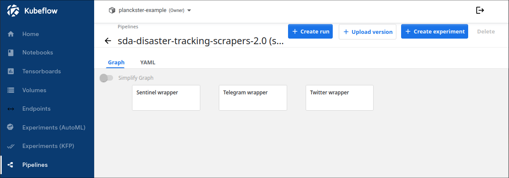
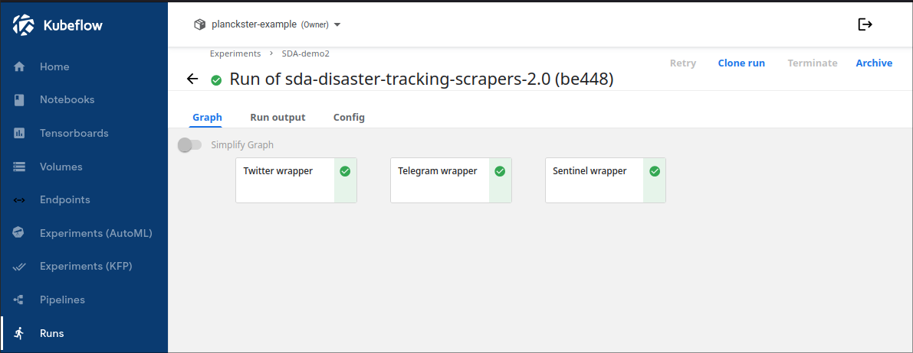
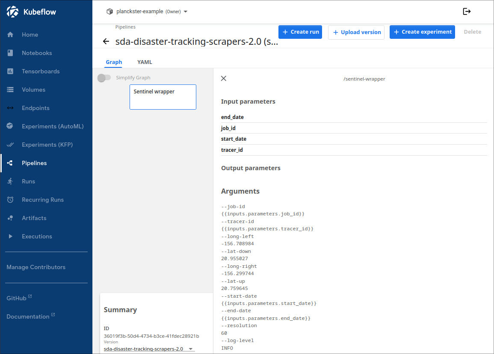
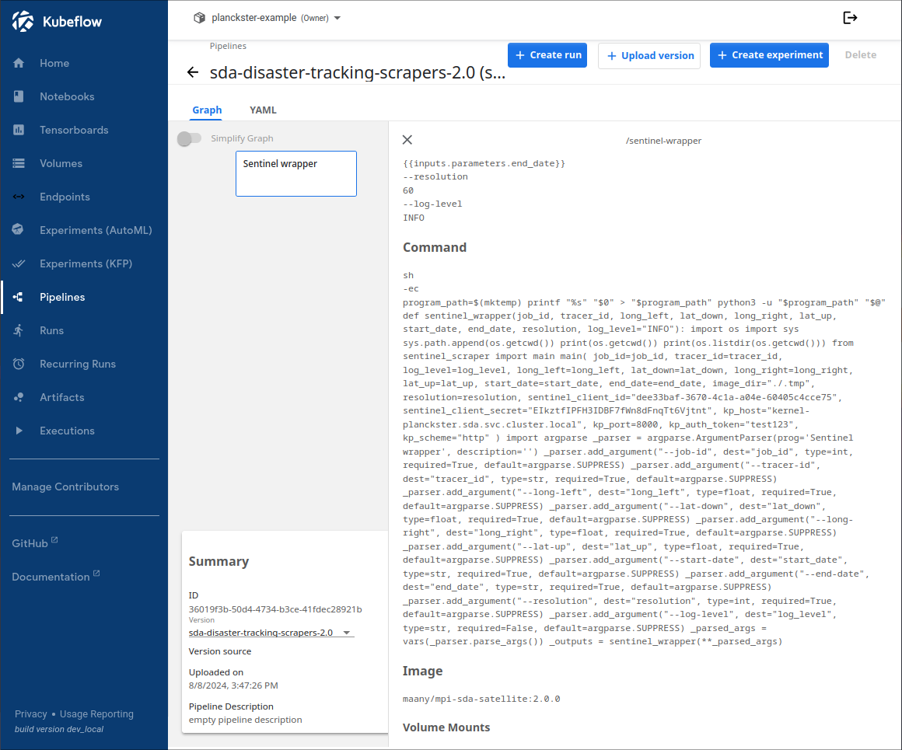
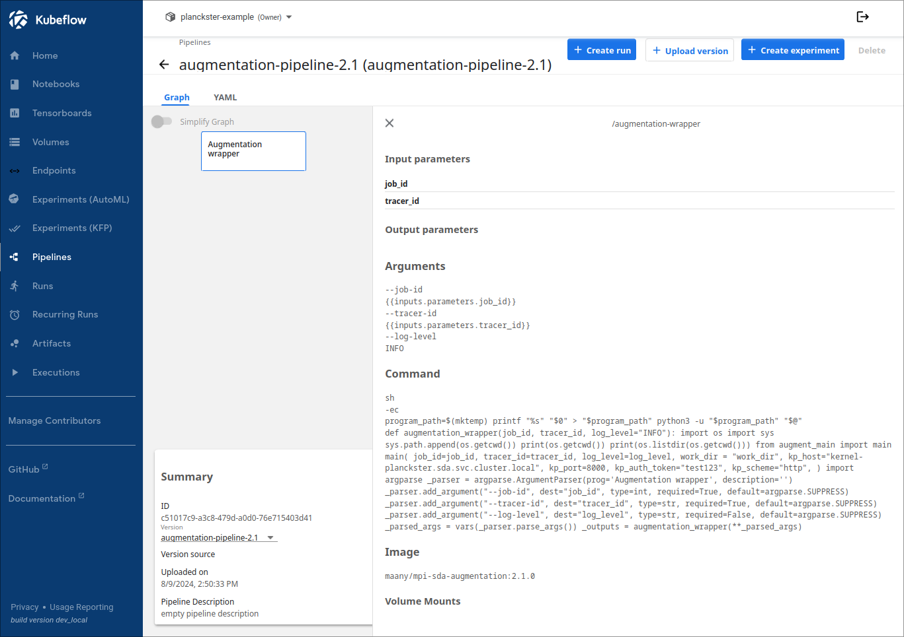
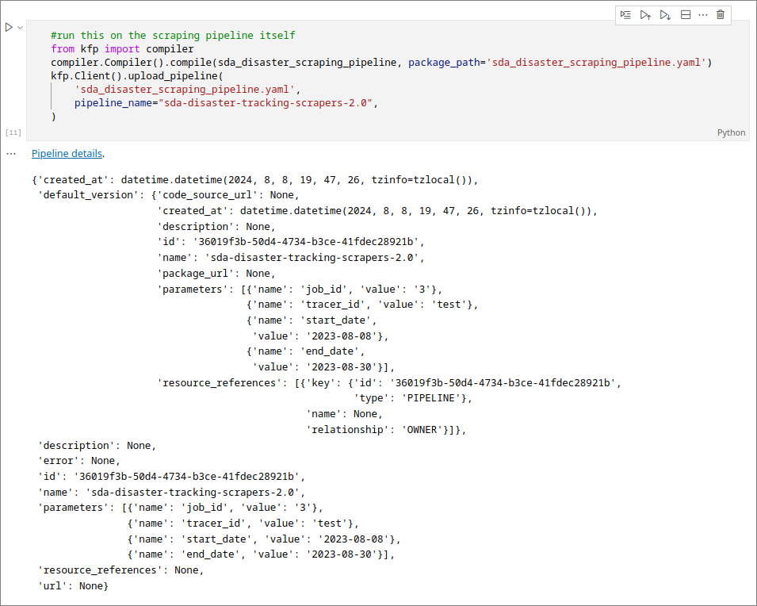

# Description of Kubeflow Pipelines for the Disaster Tracking Usecase:

## Understanding the DAG structure:

The DAG or *Directed Acyclic Graph* is the visual representation of a Kubeflow pipeline [^1]. It consists of *pipeline nodes*[^2] which are actually *wrappers*[^3] that configure and run a docker container[^4]. Below you can see how the Scraper DAG and the Augmentation Engine DAG look:

[^1]: A pipeline is a sequence of processing stages, where each stage performs a specific operation (on data or tasks) and the output becomes the input of the next stage. In the [Kubeflow introduction guide](../guides/kubeflow/kubeflow-features-and-ui-walkthrough.md) you will find a more detailed explanation of Kubeflow pipelines.
[^2]: A pipeline node is one of the stages of the pipeline.
[^3]: A wrapper is a piece of code provinding a layer of abstraction to another piece of code. 
[^4]: A Docker container is an isolated environment within a computer that encapsulates everything required to run a piece of code, program, or software. This container is created from a Docker image, which serves as a template containing the executable software package and all the necessary dependencies and configurations to ensure the program runs smoothly.

### Scraper DAG:

The Scraper DAG consists of **3 nodes** which run in parallel. Each node is a wrapper for one of the three included scrapers (sentinel, telegram, twitter).

### Augmentation Engine DAG

The Augmentation Engine DAG consists of **1 node** representing the wrapper for the disaster-usecase augmentation engine. This pipeline is run **after** the scraper pipeline successfully completes its run (meaning that all three node complete their respective runs) like it is shown below:

## Properties of a DAG element

A list of properties for an node (in this case sentinel) can be viewed by clicking on it. The most important properties include **Input parameters**, **Arguments**, **Image**, and **Version** (listed in the "Summary" box). 

### Input Parameters

Input parameters are common to the *entire pipeline* and thus every single node in the scraper pipeline shares the same start_date, end_date, job_id, and tracer_id. 

It is **essential** that these input parameters are shared across scrapers, especially job_id and tracer_id. This is because all scrapers upload their files to MinIO using the *relative-path* "/SCRAPER/TRACER_ID/JOB_ID/" where SCRAPER is one of "twitter", "telegram", or "sentinel". 

The disaster-tracking augmentation engine *expects* all scrapers to upload their *final augmented files* to "sda/SCRAPER/TRACER_ID/JOB_ID/augmented". The augmentation engine downloads all files from this path to a temporary directory, runs a matching-algorithm, and uploads the final matched files to MinIO using the *relative-path* "/augmented/TRACER_ID/JOB_ID/by_date/". 

Thus, runs for both the scraper-pipeline and augmentation-pipeline need to be constructed using the same job_id and tracer_id. This simple action allows for **linking two pipelines** which is a vital part of our overall workflow. 

### Arguments

Arguments are what are fed via the command line to the scraper before it runs. Unlike Input parameters, arguments are *node-specific* as each scraper uses different arguments depending on its context and function. Note that start-date, end_date, job_id, and tracer_id are actually *arguments*; however, their values are inherited from their *Input Parameter Value*. Note that the scraper itself actually has more arguments like api keys; however, many of these arguments are hardcoded in and thus we can only see arguments that are available to the wrapper/node. 

* The sentinel-specific arguments are "long-left" (leftmost longitude), "lat-down" (down-most latitude), "long-right" (rightmost longitude), "lat-up" (topmost latitude), and "resolution" (height of image in meters) which together represent the geographic bounding box and level of detail for a region. 
* The only telegram-specific argument is "channel-name" which is the specific publicly-available channel that should be scraped. 
* The only twitter-specific argument is "query" which is the unique search-term to use when scraping tweets.
* The augmentation engine takes no additional arguments. 

### Image [^5]

[^5]: Refers to the docker image (specific requirements to run a piece of software) that creates a docker container.

The Image name is critical as it specifies which dockerized representation of the scraper the wrapper should use. For sentinel, we choose the image "maany/mpi-sda-satellite:2.0.0" hosted on DockerHub (the other scrapers and augmentation engine are named similarly). 

Note: The docker images are built and deployed to DockerHub automatically when a release of the data scrapper is made.

### Version

The version name of the pipeline is important as every time the docker image for an node is updated to a new version the pipeline should be recompiled. To avoid conflicts, this recompiled pipeline should have an updated version name as well. 

For example the Augmentation pipeline uses an updated container image with version "2.1.0", so the pipeline version is now named "augmentation-pipeline-2.1".

## Pipeline Notebooks

#### Each Pipeline/DAG is compiled from a notebook. 

* The scraper-pipeline is compiled from the "sda-disaster-tracking-scrapers" notebook. 
* The augmentation-pipeline is compiled from the "sda-disaster-tracking-augmentation" notebook. 

### Wrappers

The notebook for a pipeline defines all of the nodes and their properties via *wrappers*. 

Note how the scraper itself has more command line arguments than what it exposes to its wrapper/node. This makes pipelines easier to configure *on a usecase basis* by focusing on real-world arguments like dates and coordinates rather than code-specific arguments like API keys. 

### Setup the pipeline/DAG

The order in which nodes run is determined by the how the pipeline is setup:

Because all three scraper tasks are executed in a single function, they run in parallel and the pipeline has a DAG with three parallel elements (as seen previously.)

### Compile the pipeline/DAG

To be able to run a pipeline, it has to be compiled and uploaded with a unique version name:

You can now navigate to the *pipelines* section of Kubeflow and create a run for the disaster tracking usecase. Once again, make sure to run the scraper pipeline *first*, check logs and MinIO to make sure the "/SCRAPER/TRACER_ID/JOB_ID/augmented" is populated for every scraper. Then run the augmentation pipeline and ensure "/augmented/TRACER_ID/JOB_ID/by_date" is populated with matched data. To work with this data, open the "SDA-disaster-tracking-demos" notebook or view the "analyzing-scraped-data" guide. 

### Conclusion

You now understand how the disaster usecase is constructed and how augmentation works. To learn more about how wrappers work and how you can build your own custom pipelines, see the guide titled "custom-pipelines". To work with the data produced by the scrapers and the augmentation engine, open the "SDA-disaster-tracking-demos" notebook or view the "analyzing-scraped-data" guide. 