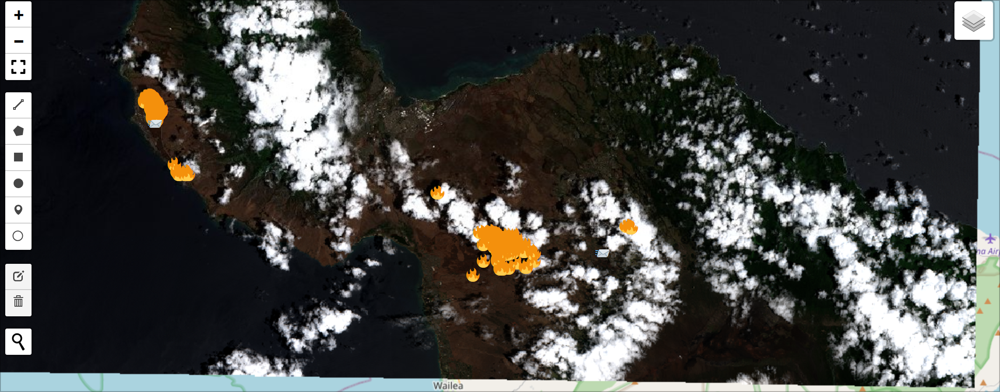

# Analyzing Scraped Data with Kubeflow Notebooks

This guide walks you through the [Kernel-Planckster Tutorial Notebook](https://kubeflow.devmaany.com/notebook/planckster-example/example-kernel-planckster/?folder=/home/jovyan/kernel-planckster-demo). It aims to provide broader detail on how to view and analyze the scraped data obtained when running the kubeflow pipelines. 

### Step 1: First, connect to kernel-planckster:

```python
kernel_planckster, protocol, file_repository = setup(
    job_id=job_id,
    logger=logger,
)
```

### Step 2: Verify the existence of scraped data:

```python
source_list = kernel_planckster.list_all_source_data()
```

There should exist an output that looks like the following:

```python
[

{'created_at': '2024-04-14T23:59:19.083454',
  'updated_at': '2024-04-14T23:59:19.083457',
  'deleted': False,
  'deleted_at': None,
  'id': 1,
  'name': '2023_08_08__2023_08_09',
  'relative_path': 'sentinel/test/1/true_color/2023_08_08__2023_08_09.png',
  'type': 'png',
  'protocol': 's3',
  'status': 'available'
},
  
{
  "created_at": "2024-04-15T04:35:20.736662",
  "updated_at": "2024-04-15T04:35:20.736667",
  "deleted": false,
  "deleted_at": null,
  "id": 130,
  "name": "2023_August_23",
  "relative_path": "augmented/by_date/2023_August_23.json",
  "type": "json",
  "protocol": "s3",
  "status": "available"
},

{

...

}

```
Note the mix of scraped and augmented data that is pulled.


### Step 3: Download all of the data sources deemed relevant to a local folder in the Kubeflow Notebook

```python
work_dir = "./.tmp"
for source in source_list:
    download_source_if_relevant(source, job_id, tracer_id, scraped_data_repository, work_dir)

```

Where ```download_source_if_relevant``` is a function that calls:

```python
signed_url = kernel_planckster.download_from_signed_url(source) 
file_repository.public_download(signed_url=signed_url, file_path="./LOCAL_DIRECTORY/some_file_name.format")

```

Or, use the utility functions in ```scraped_data_repository.py``` that take care of file naming, formatting, and saving:

* ```scraped_data_repository.download_img(source, job_id, path)```
* ```scraped_data_repository.download_json(source, job_id, path)```
* etc.


### Step 4: After saving all relevant data, perform the desired vizualizations:

**Note:** visualizations require having *matched* satellite and social media data. This type of augmentation is usually performed by an **Augmentation Repository**, but in case it has not, one can use the following code:

```python
# load tweets (or any kind of scraped social media) data that is relevant to the particular usecase (wildfires/disaster)

twitter_df = pd.read_json(f'{work_dir}/twitter_augment/data.json', orient="index")
telegram_df = pd.read_json(f'{work_dir}/telegram_augment/data.json', orient="index")
sentinel_dir = os.path.join(work_dir, "wildfire_coords")
    
# load wildfire (or any kind of disaster) data
for wildifre_coords_json_file_path in os.listdir(sentinel_dir):
    data = []
    sentinel_df= pd.read_json(os.path.join(sentinel_dir,wildifre_coords_json_file_path), orient="index")
    for index, row in sentinel_df.iloc[0:].iterrows():
        lattitude = row['latitude']
        longitude = row['longitude']
        status = row['status']
                                                    #title tweet location
        data.append([status, lattitude, longitude, "n/a", "n/a", "n/a" ])


# perform matching of satellite image disaster dates with tweets
underscore_date=wildifre_coords_json_file_path[:wildifre_coords_json_file_path.index("__")]
    split_date = underscore_date.split("_")
    sat_image_year = split_date[0]; sat_image_month = key[split_date[1]]; sat_image_day = split_date[2]
    
    
    matches_found_twitter = 0
    for index, row in twitter_df.iloc[0:].iterrows():
        tweet_title = row['Title']
        tweet_tweet = row['Tweet']
        tweet_location = row['Extracted_Location']
        tweet_latitude = row['Resolved_Latitude']
        tweet_longitude = row['Resolved_Longitude']
        tweet_month = row['Month']
        tweet_day = row['Day']
        tweet_year = row['Year']
        tweet_disaster_type = row['Disaster_Type']

        # match satellite image dates with tweet dates
        if(int(sat_image_year) == int(tweet_year) and sat_image_month == tweet_month and int(sat_image_day) == int(tweet_day)):
            matches_found_twitter += 1
            # save the data
            data.append([f"tweet about {tweet_disaster_type}", tweet_latitude, tweet_longitude, tweet_title, tweet_tweet, tweet_location ])
        

```

Clearly, tweets that are relevant to a particular disaster and ouccur on the same day as disasters detected by sattelite images are matched and the locations of both types of data can be compared and analyzed.

### Step 5: Analyze the output using leafmap:

1. Load the true-color image from our sentinel dataset:
```python
from pystac_client import Client

client = Client.open("https://planetarycomputer.microsoft.com/api/stac/v1")

search = client.search(
    max_items=10,
    collections=['sentinel-2-l2a'],
    bbox=[-156.708984, 20.759645, -156.299744, 20.955027],
    datetime="2023-08-08/2023-08-25",
)
items = search.item_collection()
for item in items:
    print(item.id)

```

2. Create the interactive leafmap:

```python
import leafmap.foliumap as leafmap #choose one of 6 plotting backends

m = leafmap.Map()
m.add_stac_layer(
    collection="sentinel-2-l2a",
    item = items[0].id, #choose the latest one to display
    assets=["B04", "B03", "B02"],
)
# load the map in jupyter:
m

```

3. Overlay the augmented social media data and disaster events:

```python
work_dir = './.tmp'  #  define your work directory here
bounding_box = (-156.708984,20.759645,-156.299744,20.955027) #set coords as well
import os
import pandas as pd
from folium.features import DivIcon

for file_path in os.listdir(os.path.join(work_dir, "by_date")):
    if file_path.endswith('.json'):  # check to ensure only json files are processed
        df = pd.read_json(os.path.join(work_dir, "by_date", file_path), orient="index")

        for index, row in df.iloc[0:].iterrows():
            status = row['Status']
            latitude = row['Lattitude']
            longitude = row['Longitude']
            title = row['Title']
            text = row['Text']
            
            icon_text=''
            icon_size=''

            if "tweet" in status:
                icon_text='&#128038;'   # Unicode for the bird emoji
                icon_size=(100,100)
                folium.Marker(
                [latitude,longitude],
                icon=DivIcon(
                    icon_size=icon_size,
                    icon_anchor=(0,0),
                    html='<div style="font-size: 12pt">%s</div>' % icon_text,
                    ),
                popup = text
            ).add_to(m)

            elif "fire" in status: #wildfire
                icon_text='&#128293;'   # Unicode for fire emoji
                icon_size=(30,30)
                folium.Marker(
                [latitude,longitude],
                icon=DivIcon(
                    icon_size=icon_size,
                    icon_anchor=(0,0),
                    html='<div style="font-size: 12pt">%s</div>' % icon_text,
                    ),
                ).add_to(m)
                

# render the final output:
m
```

The output should be interactive and have dynamic overlays:



